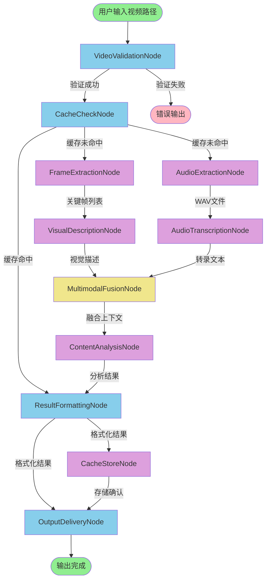

# Flow设计结果

## Flow概述
- **Flow名称**: 多模态视频智能解析Flow
- **Flow描述**: 对本地视频文件进行端到端的多模态内容理解，包括视频验证、缓存检查、音视频分离、并行转录与视觉描述、跨模态融合、智能分析、结果格式化与输出
- **起始节点**: VideoValidationNode

## Flow图表

## 节点连接关系

### 连接 1
- **源节点**: VideoValidationNode
- **目标节点**: CacheCheckNode
- **触发Action**: default
- **转换条件**: 视频文件验证成功
- **传递数据**: 视频文件路径和基础元数据（时长、分辨率、编码格式等）

### 连接 2
- **源节点**: CacheCheckNode
- **目标节点**: FrameExtractionNode
- **触发Action**: default
- **转换条件**: 缓存未命中，需要重新处理
- **传递数据**: 视频文件路径和提取参数（每秒1帧或场景检测阈值）

### 连接 3
- **源节点**: CacheCheckNode
- **目标节点**: AudioExtractionNode
- **触发Action**: default
- **转换条件**: 缓存未命中，需要重新处理
- **传递数据**: 视频文件路径和输出目录配置

### 连接 4
- **源节点**: FrameExtractionNode
- **目标节点**: VisualDescriptionNode
- **触发Action**: default
- **转换条件**: 关键帧提取完成
- **传递数据**: 关键帧文件路径列表及对应时间戳

### 连接 5
- **源节点**: AudioExtractionNode
- **目标节点**: AudioTranscriptionNode
- **触发Action**: default
- **转换条件**: 音频提取完成
- **传递数据**: WAV音频文件路径和语言配置

### 连接 6
- **源节点**: VisualDescriptionNode
- **目标节点**: MultimodalFusionNode
- **触发Action**: default
- **转换条件**: 视觉描述生成完成
- **传递数据**: 视觉描述列表（包含时间戳、描述文本、置信度）

### 连接 7
- **源节点**: AudioTranscriptionNode
- **目标节点**: MultimodalFusionNode
- **触发Action**: default
- **转换条件**: 音频转录完成
- **传递数据**: 转录文本列表（包含时间戳、文本内容、置信度）

### 连接 8
- **源节点**: MultimodalFusionNode
- **目标节点**: ContentAnalysisNode
- **触发Action**: default
- **转换条件**: 多模态上下文构建完成
- **传递数据**: 融合后的多模态上下文对象

### 连接 9
- **源节点**: ContentAnalysisNode
- **目标节点**: ResultFormattingNode
- **触发Action**: default
- **转换条件**: 内容分析完成
- **传递数据**: 结构化分析结果（JSON格式）

### 连接 10
- **源节点**: CacheCheckNode
- **目标节点**: ResultFormattingNode
- **触发Action**: default
- **转换条件**: 缓存命中，直接返回结果
- **传递数据**: 缓存中的格式化结果

### 连接 11
- **源节点**: ResultFormattingNode
- **目标节点**: OutputDeliveryNode
- **触发Action**: default
- **转换条件**: 结果格式化完成
- **传递数据**: 格式化后的结果对象和输出配置

### 连接 12
- **源节点**: ResultFormattingNode
- **目标节点**: CacheStoreNode
- **触发Action**: default
- **转换条件**: 需要缓存新处理结果
- **传递数据**: 视频哈希值和处理结果

### 连接 13
- **源节点**: CacheStoreNode
- **目标节点**: OutputDeliveryNode
- **触发Action**: default
- **转换条件**: 缓存存储完成
- **传递数据**: 存储确认信息

## 执行流程

### 步骤 1
- **节点**: VideoValidationNode
- **描述**: 验证输入视频文件的完整性和格式兼容性
- **输入数据**: 用户提供的本地视频文件路径
- **输出数据**: 包含视频元数据的字典对象传递给CacheCheckNode

### 步骤 2
- **节点**: CacheCheckNode
- **描述**: 检查视频是否已处理过，避免重复计算
- **输入数据**: 视频文件路径和元数据
- **输出数据**: 根据缓存命中情况，直接跳转到ResultFormattingNode或继续后续处理流程

### 步骤 3
- **节点**: FrameExtractionNode（并行执行）
- **描述**: 并行提取视频关键帧，支持每秒1帧或场景切换检测
- **输入数据**: 视频文件路径和提取参数
- **输出数据**: 关键帧文件路径列表及时间戳传递给VisualDescriptionNode

### 步骤 4
- **节点**: AudioExtractionNode（与FrameExtractionNode并行）
- **描述**: 异步提取音频轨道为WAV格式
- **输入数据**: 视频文件路径和输出目录
- **输出数据**: WAV文件路径传递给AudioTranscriptionNode

### 步骤 5
- **节点**: VisualDescriptionNode
- **描述**: 批量使用多模态LLM生成关键帧的视觉描述
- **输入数据**: 关键帧文件路径列表
- **输出数据**: 视觉描述列表传递给MultimodalFusionNode

### 步骤 6
- **节点**: AudioTranscriptionNode
- **描述**: 使用Whisper模型将音频转录为带时间戳的文本
- **输入数据**: WAV音频文件路径
- **输出数据**: 转录文本列表传递给MultimodalFusionNode

### 步骤 7
- **节点**: MultimodalFusionNode
- **描述**: 按时间轴精确对齐转录文本和视觉描述
- **输入数据**: 视觉描述列表和转录文本列表
- **输出数据**: 融合后的多模态上下文对象传递给ContentAnalysisNode

### 步骤 8
- **节点**: ContentAnalysisNode
- **描述**: 基于融合上下文执行摘要提取、问答等智能分析任务
- **输入数据**: 多模态上下文和用户任务指令
- **输出数据**: 结构化分析结果传递给ResultFormattingNode

### 步骤 9
- **节点**: ResultFormattingNode
- **描述**: 将分析结果转换为JSON/Markdown格式
- **输入数据**: 原始分析结果和格式化配置
- **输出数据**: 格式化结果分别传递给OutputDeliveryNode和CacheStoreNode

### 步骤 10
- **节点**: CacheStoreNode
- **描述**: 异步存储处理结果到缓存
- **输入数据**: 视频哈希值和处理结果
- **输出数据**: 存储确认信息传递给OutputDeliveryNode

### 步骤 11
- **节点**: OutputDeliveryNode
- **描述**: 输出最终结果到指定位置，生成查看器索引
- **输入数据**: 格式化结果和输出配置
- **输出数据**: 输出文件路径和查看器启动信息

## 设计理由
1. **并行优化设计**: FrameExtractionNode和AudioExtractionNode并行执行，VisualDescriptionNode和AudioTranscriptionNode并行处理，充分利用GPU资源
2. **缓存机制**: CacheCheckNode和CacheStoreNode形成完整的缓存生命周期，避免重复处理相同视频
3. **错误处理**: 对可能失败的IO和计算任务（FrameExtractionNode、AudioExtractionNode、VisualDescriptionNode、AudioTranscriptionNode、ContentAnalysisNode、CacheStoreNode）启用重试机制
4. **数据流完整性**: 从输入验证→缓存检查→音视频分离→多模态处理→信息融合→智能分析→结果输出，形成闭环
5. **扩展性**: 各节点通过标准数据格式交互，可轻松替换或升级单个组件（如更换Whisper模型版本）
6. **性能优化**: 使用BatchNode处理计算密集型任务（VisualDescriptionNode、AudioTranscriptionNode），支持GPU批处理
7. **用户体验**: 缓存命中时直接跳转到结果输出，大幅提升重复视频的处理速度