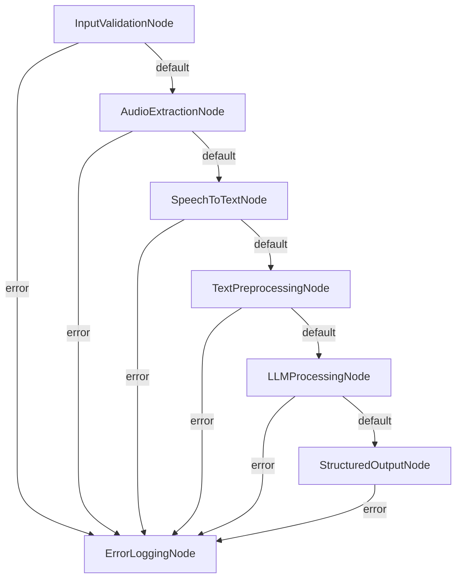

# 创建一个智能体，解析本地视频并使用LLM生成结构化输出。需要完成音频提取、语音转文字、文本解析等任务...

本文档旨在设计一个基于PocketFlow框架的智能体，用于从本地视频文件中提取音频、转换为文本，并通过LLM（大语言模型）生成结构化输出。此Agent将支持多步骤处理流水线，涵盖从输入验证到最终结果导出的完整流程。

---

## 项目需求

### 目标
创建一个智能体，能够解析本地视频文件并生成结构化的关键信息输出。主要目标包括：
1. **音频提取**：从用户提供的视频文件中提取音频流。
2. **语音转文字**：将提取的音频内容转换为文本形式。
3. **文本解析**：通过LLM对文本进行深度分析，提取语义化的关键信息。
4. **结构化输出**：将解析结果组织为JSON或其他标准化格式供用户下载或集成。
5. **错误检查与日志记录**：确保每一步骤的执行完整性，并记录潜在问题。

### 功能需求
- 支持多种常见视频格式（如MP4、AVI等）。
- 音频提取工具需兼容主流格式（如WAV、MP3）。
- 使用ASR服务实现高准确率的语音转文字功能。
- LLM解析需支持上下文理解，并生成高质量的结构化输出。
- 提供完整的错误捕获和日志记录机制，便于问题追踪与优化。

---

## 工具函数

为了实现上述需求，以下工具函数和外部服务将被集成：
1. **FFmpeg**：用于从视频文件中提取音频流。
2. **Whisper或其他ASR工具**：用于将音频转换为文本。
3. **LLM模型（如GPT）**：用于对文本进行深度解析并生成结构化输出。
4. **自定义日志工具**：用于记录每个步骤的执行状态和错误信息。
5. **Python标准库**：如`json`模块用于序列化输出数据。

---

## Flow设计

### 整体设计思路
该Flow采用模块化设计，每个Node专注于单一职责，通过Action驱动实现节点间的切换。整体流程分为七个主要步骤，从输入验证到最终结果导出，确保完整的数据流转和错误处理机制。

### 节点连接和Action驱动逻辑
1. **InputValidationNode**：验证输入文件的合法性。
   - Action `default` → 进入下一步（AudioExtractionNode）。
   - Action `error` → 触发ErrorLoggingNode记录错误。
2. **AudioExtractionNode**：提取音频流。
   - Action `default` → 进入SpeechToTextNode。
   - Action `error` → 记录错误。
3. **SpeechToTextNode**：将音频转换为文本。
   - Action `default` → 进入TextPreprocessingNode。
   - Action `error` → 记录错误。
4. **TextPreprocessingNode**：清理和格式化文本。
   - Action `default` → 进入LLMProcessingNode。
   - Action `error` → 记录错误。
5. **LLMProcessingNode**：解析文本并生成结构化输出。
   - Action `default` → 进入StructuredOutputNode。
   - Action `error` → 记录错误。
6. **StructuredOutputNode**：导出最终结果。
   - Action `download` → 提供下载链接。
   - Action `error` → 记录错误。
7. **ErrorLoggingNode**：统一记录所有节点的错误信息。

### 执行流程描述
1. 用户上传视频文件或提供文件路径。
2. InputValidationNode验证输入文件是否合法。
3. AudioExtractionNode提取音频流并保存为标准化格式。
4. SpeechToTextNode将音频转换为文本内容。
5. TextPreprocessingNode清理和格式化文本。
6. LLMProcessingNode解析文本并生成结构化输出。
7. StructuredOutputNode将结果导出为JSON或其他格式。
8. ErrorLoggingNode记录所有错误信息。

### Flow图表

---

## 数据结构

### shared存储设计
shared存储作为全局数据上下文，贯穿整个流程，确保数据在各个节点间高效流转。

#### 字段定义和用途
1. **video_file_path**：用户提供的视频文件路径。
2. **uploaded_video_file**：用户上传的视频文件对象（二进制数据）。
3. **validated_video_file_path**：经过验证的视频文件路径。
4. **audio_file_path**：提取的音频文件路径。
5. **text_content**：语音转文字后生成的文本内容。
6. **cleaned_text**：清理和格式化后的文本内容。
7. **structured_output**：LLM解析生成的结构化输出（JSON格式）。
8. **output_file_path**：最终导出的结果文件路径。
9. **log_status**：日志记录状态。
10. **last_logged_step**：最后记录日志的步骤名称。

#### 数据流转模式
- 每个Node根据其职责读取必要的字段，并写入处理结果。
- 错误信息和中间状态均通过shared传递至ErrorLoggingNode。

---

## Node设计

### InputValidationNode

#### Purpose
验证用户输入的视频文件路径或上传的视频文件是否有效。

#### Design
- **类型**: Node
- **异步**: 否

#### Data Access
- **读取字段**: video_file_path, uploaded_video_file
- **写入字段**: validated_video_file_path, is_file_valid

#### Prep阶段
- 初始化支持的视频格式列表。
- 验证输入数据的完整性和合法性。

#### Exec阶段
- 根据输入类型（路径或上传文件），执行格式兼容性检查与文件完整性校验。
- 如果验证失败，触发error Action。

#### Post阶段
- 更新shared存储，设置下一步Action。

---

### AudioExtractionNode

#### Purpose
从视频文件中提取音频流并保存为标准化格式。

#### Design
- **类型**: AsyncNode
- **异步**: 是

#### Data Access
- **读取字段**: validated_video_file_path
- **写入字段**: audio_file_path

#### Prep阶段
- 验证输入视频文件的有效性。
- 初始化FFmpeg工具和配置参数。

#### Exec阶段
- 调用FFmpeg提取音频流并保存为WAV或MP3格式。
- 捕获异常并触发重试机制。

#### Post阶段
- 确认音频文件生成成功，更新shared存储。

---

### SpeechToTextNode

#### Purpose
将提取的音频流转换为文本内容。

#### Design
- **类型**: AsyncNode
- **异步**: 是

#### Data Access
- **读取字段**: audio_file_path
- **写入字段**: text_content

#### Prep阶段
- 验证音频文件的有效性。
- 初始化ASR服务客户端。

#### Exec阶段
- 调用ASR服务将音频转换为文本。
- 处理超时或失败情况，触发重试。

#### Post阶段
- 清理和标准化文本内容，更新shared存储。

---

### TextPreprocessingNode

#### Purpose
清理和格式化文本以提高后续解析质量。

#### Design
- **类型**: Node
- **异步**: 否

#### Data Access
- **读取字段**: text_content
- **写入字段**: cleaned_text

#### Prep阶段
- 验证文本内容的完整性。

#### Exec阶段
- 移除噪声、标准化标点符号、分段整理。

#### Post阶段
- 更新shared存储，设置下一步Action。

---

### LLMProcessingNode

#### Purpose
使用LLM模型对文本进行深度解析并生成结构化输出。

#### Design
- **类型**: AsyncNode
- **异步**: 是

#### Data Access
- **读取字段**: cleaned_text, llm_model_config
- **写入字段**: structured_output

#### Prep阶段
- 验证文本内容和模型配置的有效性。

#### Exec阶段
- 调用LLM模型生成结构化输出。
- 处理分段文本的连贯性。

#### Post阶段
- 验证解析结果完整性，更新shared存储。

---

### ErrorLoggingNode

#### Purpose
记录每个步骤的错误与日志。

#### Design
- **类型**: Node
- **异步**: 否

#### Data Access
- **读取字段**: current_step_name, error_message, input_data, output_data
- **写入字段**: log_status, last_logged_step

#### Prep阶段
- 初始化日志记录器和存储路径。

#### Exec阶段
- 格式化并写入错误日志。

#### Post阶段
- 确认日志记录成功，更新shared存储。

---

### StructuredOutputNode

#### Purpose
将最终解析结果导出为JSON或其他标准化格式。

#### Design
- **类型**: Node
- **异步**: 否

#### Data Access
- **读取字段**: structured_output
- **写入字段**: output_file_path, export_status

#### Prep阶段
- 验证输入数据的完整性和格式。

#### Exec阶段
- 将解析结果序列化为JSON并保存为文件。

#### Post阶段
- 确认文件生成成功，更新shared存储。
